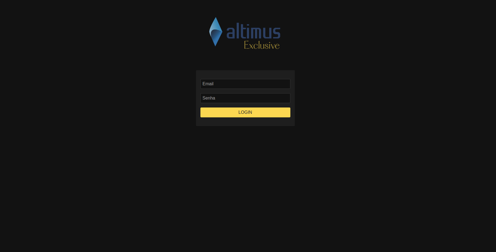
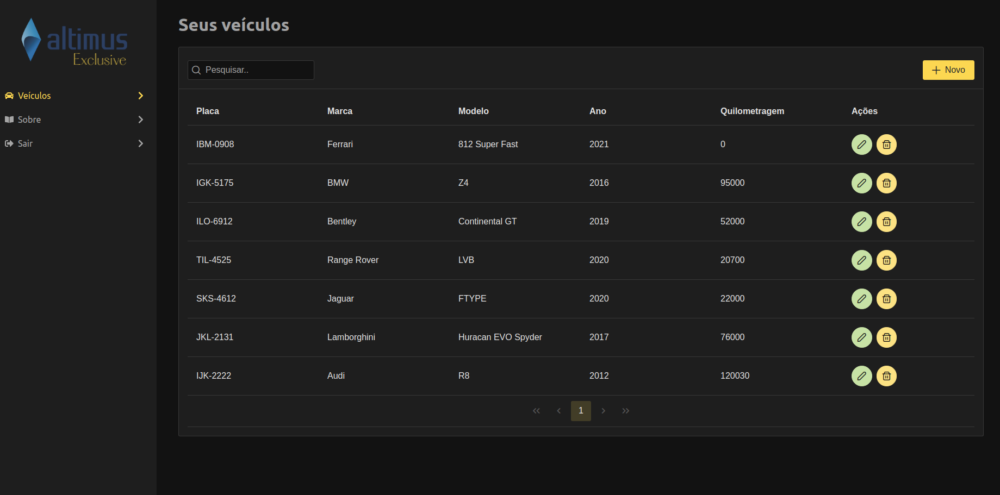
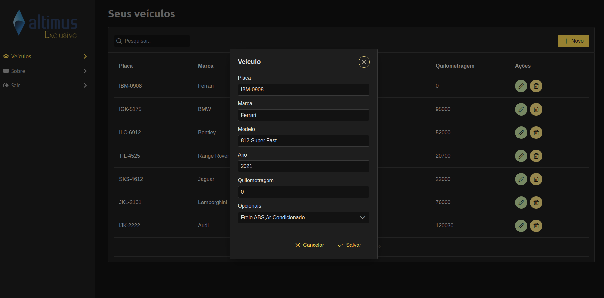

# Altimus Exclusive - Thales Kenne

Altimus Exclusive is a web dashboard with a CRUD for a vehicle list as well as a search feature.

### :cd: Technologies and Features

- Reactjs
- Typescript
- Eslint/Prettier
- Functional components
- Hooks
- Responsive layout for mobile and web

### :sunglasses: Reasoning behind features

- I chose not to create a "search screen" as that would force the user to have an extra interaction with the platform before seeing any list of vehicles. Instead, the user is taken straight into the usable part of the application after log in.

- The login is just a mock and has no security value. The application auth state is persisted through a mock token in the local storage. Any route other than `/login` will require the token to be present.

- There is an extra `about` screen just so that the sidebar would not feel too empty and to showcase some extra navigation.

- I added a small delay to simulate backend response time on login and a toast in case of failed authentication.

### :exclamation: Known issues

- I didn't persist any data other than the auth token.

- In a real world application, the search bar would search for vehicles through a backend endpoint, and not in the local list of vehicles.

- I didn't add any loading indicator to simulate a search for vehicles.

- The css classes and modules are a bit messy. I tried to use PrimeReact classes as much as I could and therefore I didn't really come up with a defined strategy to deal with customization.

### :computer: Instructions to run

- Clone the repo
- Run `yarn` or `npm install` to install dependencies
- Run `yarn start` or `npm run start` to start the application on port `:3000`
- Login credentials: `altimus@exclusive.com` and password `123456`
- If there is an issue with typescript, make sure you're using the project version of typescript and not the editor's.

### :camera: Preview

